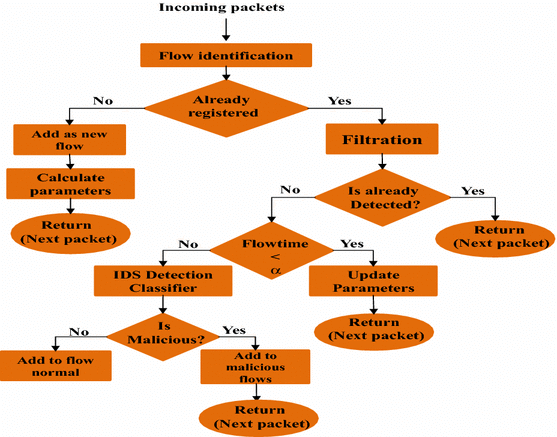

El laboratorio de ciberseguridad de una empresa necesita analizar los paquetes de red enviados entre el departamento de 
Recursos humanos y el departamento de ventas, aplicando un modelo de reconocimiento de patrones para identificar
posibles anomalias de seguridad. Describe con palabras y diagramas que solucion propone y porque. 
Tome en cuenta factores como rendimiento tiempo y de desarrollo en su proquesta.

## PROPUESTA 
El IDS sería implementado como una solución de software que monitorearía el tráfico de red en tiempo real y aplicaría algoritmos de análisis de patrones para identificar posibles anomalías de seguridad. Estas anomalías podrían incluir comportamientos sospechosos, intentos de intrusión o actividades maliciosas en la red.

### El tiempo de pleaneacion seleccion y desarrollo sera de 7 meses, con un equipo altamenete motivado coformado por 15 personas. 

tomando en cuenta factores de rendimoneto tenememos falsos postivos, dataset desbalanceados, tiempos de respuesta lentos, nivel de deteccion bajo. 

Una de las principales ventajas de utilizar un modelo de reconocimiento de patrones en el IDS es su capacidad para aprender y adaptarse a nuevos patrones de amenazas a medida que se descubren. Esto significa que el sistema puede mejorar su eficacia con el tiempo a medida que se exponga a más datos y patrones de tráfico de red.

### Tomemos como referencia este algoritmo que se usara como base para la implementacion. 
 # 
